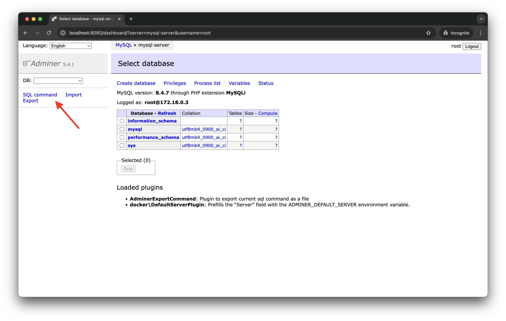
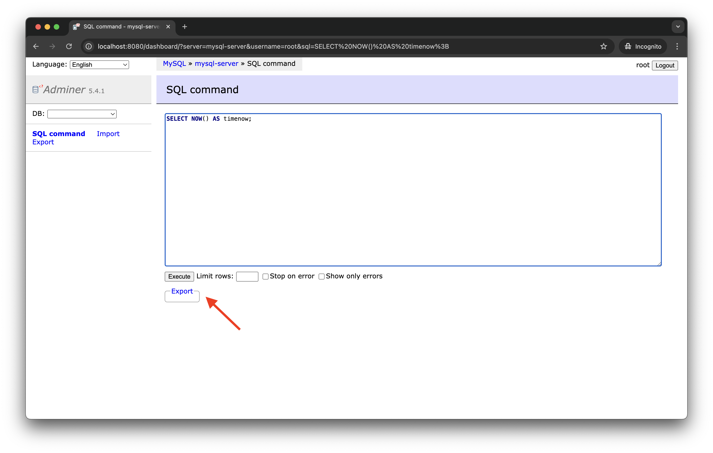

# Adminer Export Command Plugin

A plugin for [Adminer](https://www.adminer.org/) that adds functionality to export SQL commands as downloadable files directly from the SQL command editor interface.

## Overview

When working with databases through Adminer, users often need to save their SQL queries for documentation, sharing, or version control. While Adminer provides excellent database management capabilities, it lacks a straightforward way to export the current SQL command being edited.

This plugin solves that problem by adding an **Export** link/button to the SQL command editor, allowing users to:

- Download SQL queries as files with appropriate extensions (`.sql`, `.js`, `.json`, etc.) based on the database driver
- Open queries in a new browser window for quick viewing
- Automatically timestamp exported files for better organization
- Preserve their work for future reference or sharing

## Features

- **Smart File Extensions** – Automatically determines the correct file extension based on the database driver (MySQL, PostgreSQL, MongoDB, Elasticsearch, etc.)
- **Multiple Output Options** – Export to file or open in a new browser tab
- **Timestamp Support** – Files are named with timestamps (e.g., `query_20250131_143025.sql`)
- **CodeMirror Integration** – Works seamlessly with Adminer’s CodeMirror SQL editor
- **Lightweight** – Minimal footprint, no external dependencies

---

## Installation

You can use this plugin with the official Adminer Docker image or in a non-Docker setup.

For reference on how to enable and use Adminer plugins, see the official documentation:  
👉 [https://www.adminer.org/en/plugins/#use](https://www.adminer.org/en/plugins/#use)

### Option A: Docker Compose

```yaml
# docker-compose.yml
services:
  adminer:
    image: adminer:latest
    environment:
      - ADMINER_PLUGINS=export-command
    ports:
      - 8080:8080
    volumes:
      - ./export-command.php:/var/www/html/plugins/export-command.php:ro
```

Then start Adminer:

```sh
docker compose up -d
```

Access Adminer at [http://localhost:8080](http://localhost:8080).

### Option B: Docker (docker run)

Run Adminer with the plugin enabled and the file mounted:

```sh
docker run -d \
  --name adminer \
  -p 8080:8080 \
  -e ADMINER_PLUGINS=export-command \
  -v "$PWD/export-command.php":/var/www/html/plugins/export-command.php:ro \
  adminer:latest
```

If the container is already running:

```sh
docker cp export-command.php adminer:/var/www/html/plugins/export-command.php
docker restart adminer
```

### Option C: Non-Docker (manual setup)

If you’re running Adminer outside of Docker:

1. Place `export-command.php` in your Adminer `plugins/` directory.
2. Enable it following Adminer’s official plugin usage guide:  
   👉 [https://www.adminer.org/en/plugins](https://www.adminer.org/en/plugins)

## Usage

1. **Navigate to SQL Command**: Open Adminer and go to the "SQL command" page
   

2. **Write Your Query and Click Export**: Enter your SQL query in the text area and click in the "Export" fieldset below
   

3. **Select Output and Format**: Choose your desired output (i.e., `open`, `save`) and format (based on the database driver)
   

4. **Click Export**: Click the "Export" button
   

5. **Download**: Your query will be downloaded with a timestamped filename like `query_20250131_143025.sql`

## How To Contribute

If you would like to help contribute, please see [CONTRIBUTING](https://github.com/rlaiola/adminer-export-command/blob/main/CONTRIBUTING.md).

Before submitting a PR, lint your code with Super-Linter:

```sh
docker run --rm \
           -e ACTIONS_RUNNER_DEBUG=true \
           -e RUN_LOCAL=true \
           --env-file ".github/super-linter.env" \
           -v "$PWD":/tmp/lint \
           ghcr.io/super-linter/super-linter:latest
```

## License

Copyright Universidade Federal do Espirito Santo (Ufes)

This program is free software: you can redistribute it and/or modify
it under the terms of the GNU General Public License as published by
the Free Software Foundation, either version 3 of the License, or
(at your option) any later version.

This program is distributed in the hope that it will be useful,
but WITHOUT ANY WARRANTY; without even the implied warranty of
MERCHANTABILITY or FITNESS FOR A PARTICULAR PURPOSE. See the
GNU General Public License for more details.

You should have received a copy of the GNU General Public License
along with this program. If not, see <https://www.gnu.org/licenses/>.

This program is released under license GNU GPL v3+ license.

## Support

Please report any issues with _adminer-export-command_ at [https://github.com/rlaiola/adminer-export-command/issues](https://github.com/rlaiola/adminer-export-command/issues)
